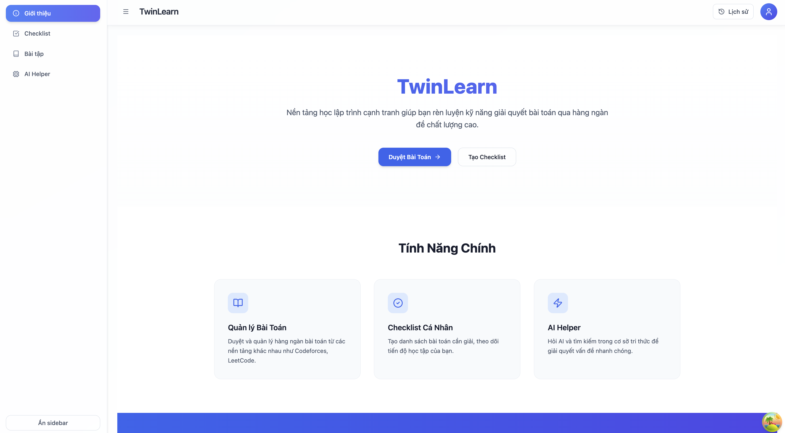
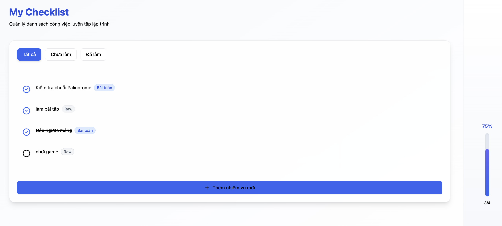
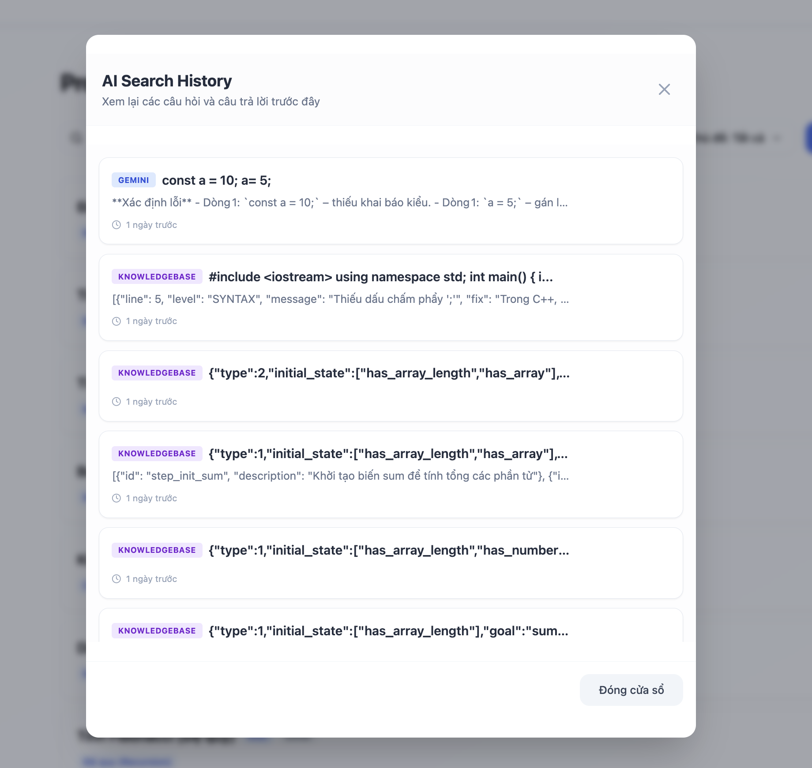
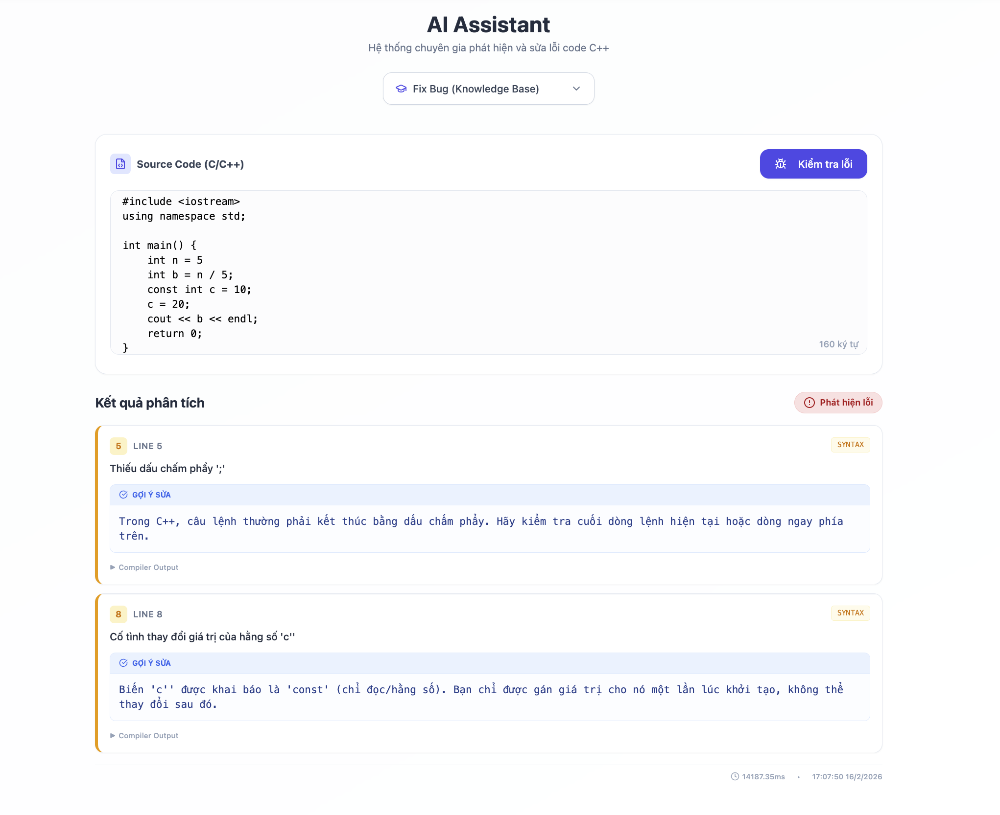
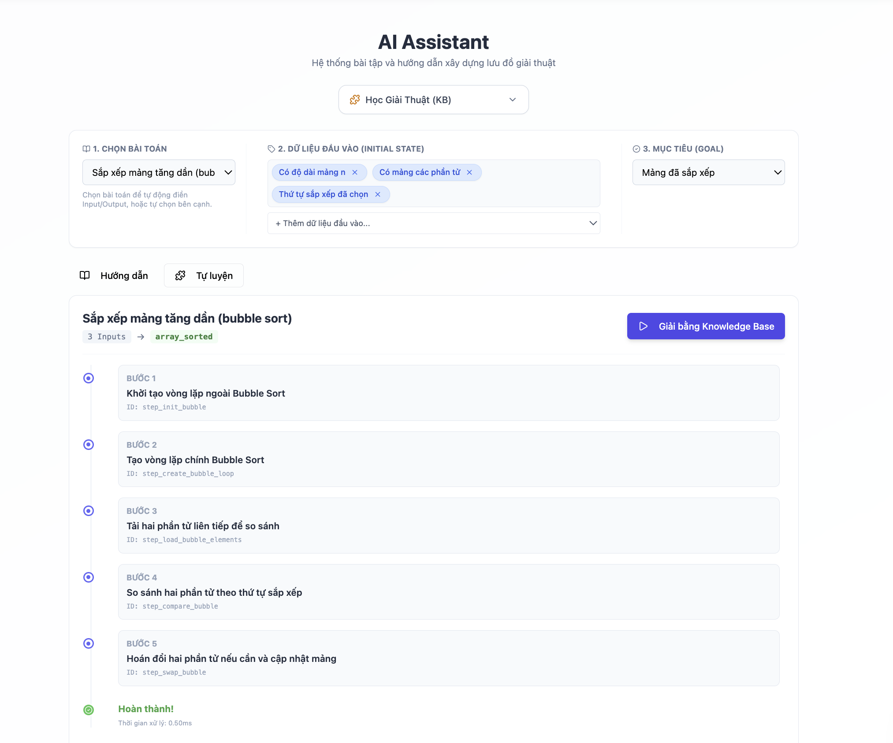
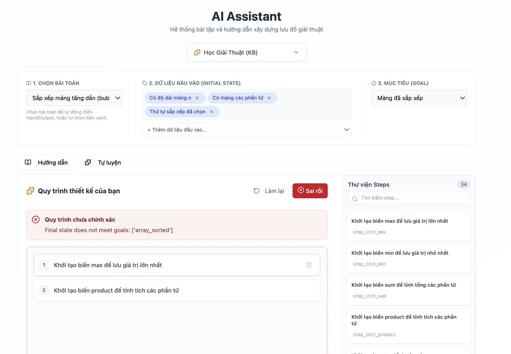
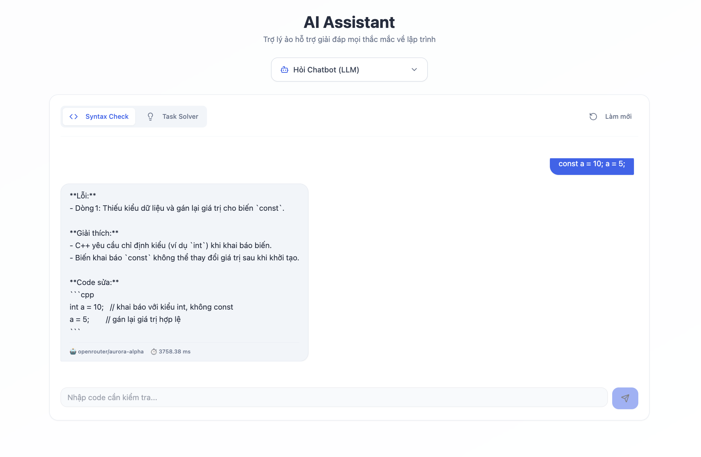

# 💻 TwinLearn - Frontend Client

This module contains the user interface for **TwinLearn**, built with **React (TypeScript), **Vite** and **TanStack Query\*\*.

## 📸 Screenshots & Features

### 1️⃣ Introduction

A comprehensive **Dashboard interface** that introduces the platform and provides quick access shortcuts to main features.

---

### 2️⃣ Problems (Exercise Bank)

A curated list of **C++ programming exercises** categorized by difficulty.  
Students can view problem statements and practice coding.

---

### 3️⃣ Checklist (Progress Tracking)

An interactive **Checklist tool** allowing students to mark mastered C++ concepts (e.g., Pointers, OOP, Recursion), effectively managing their learning path.

---

### 4️⃣ AI Search History

Centralized storage for all AI interactions.  
Users can review past **Syntax Checks** or solved logical problems (**Task Solver**) to learn from previous sessions.

![History Page Screenshot]

---

### 5️⃣ AI Helper

Consisting of two powerful modes:

#### 🔎 Syntax Checker

- Analyzes C++ syntax errors
  

#### 🔎 Task Solver

**Guide Mode**

- Visualizes step-by-step algorithms for logical problems.
- Have LLM Mode and Knowledge Based mode.
  

**Practice Mode**

- Students design their own solution workflow
- AI validates and grades the solution
  

#### LLM Mode

- Leverages Generative AI to provide natural language explanations and context-aware assistance

