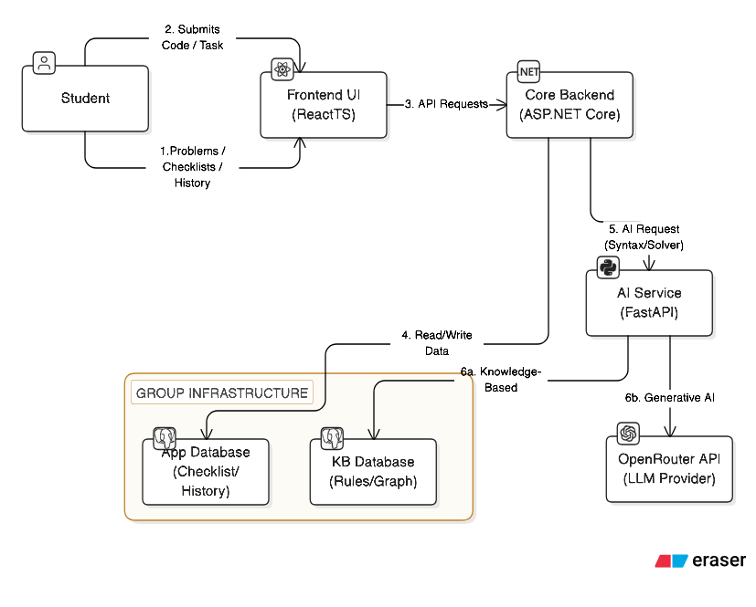

# **🚀 TwinLearn: AI-Powered C++ Learning Platform**



## **📖 Overview**

**TwinLearn** is an educational platform designed to assist students in mastering C++ programming. Backend service follows Clean Architecture principles.

The system is built using a **Microservices-lite architecture** with a Database-per-service pattern.

## **✨ Key Features**

### **🧠 Dual-Engine AI Assistant**

1. **Knowledge-Based Engine (KB):** Uses rule-based logic and internal compilation for precise syntax fixing and logical task solving (Graph Search).
2. **LLM Engine:** Integrates with Large Language Models (via OpenRouter) for natural language explanations and complex context understanding.

### **📚 Smart Learning Tools**

- **AI History Tracking:** Automatically archives all AI interactions , allowing students to review past solutions and learn from mistakes.
- **Interactive Checklists:** Enables users to build and track to visualize progress.
- **Curated Problem Bank:** A structured database of C++ exercises ranging from beginner to advanced levels.

Note: For more details, see [Slide](./dpcs/CSTT.pdf)

## **🛠️ Tech Stack**

- **Frontend:** ReactTS, Tailwind CSS, TanStack Query. ([More Detail](./frontend/README.md))
- **Core Backend:** **.NET 9 Web API**, Clean Architecture, Entity Framework Core, AutoMapper. ([More Detail](./backend/README.md))
- **AI Service:** Python FastAPI, SQLModel ([More Detail](./python-service/README.md))
- **Database:** PostgreSQL (through Docker).

## **🚀 Setup & Installation**

### **Step 1: Start Infrastructure (Databases)**

We use Docker Compose to spin up two isolated PostgreSQL instances (one for the Core App, one for the AI Knowledge Base) (you must install [Docker Desktop](https://www.docker.com/products/docker-desktop/) first).

```bash
docker-compose up -d
```

### **Step 2: Setup AI Service (Python)**

This service is responsible for the AI logic (Syntax Checker & Task Solver).

**1\. Create & Activate Virtual Environment**

```bash
cd python-service
python -m venv venv
source venv/bin/activate \# Windows: venv\\Scripts\\activate
```

**2\. Install Dependencies**

```bash
pip install -r requirements.txt
```

**3\. Environment Configuration**

Create a .env file in the python-service root directory with the following content:

```python
LLM_API_KEY=your_api_key_here
LLM_MODEL=openrouter/aurora-alpha

DB_HOST=localhost
DB_PORT=5433
DB_NAME=ai_kb_db
DB_USER=ai_user
DB_PASSWORD=ai_pass

LOG_LEVEL=INFO
```

**4\. Run Service**

```bash
cd src

python -m uvicorn main:app --reload
```

_Note: The service will automatically seed the Knowledge Base database on startup._

### **Step 3: Setup Core Backend (.NET)**

This service acts as the main gateway and manages user data (History, Checklists, Problems).

```bash
cd backend/src/Api

dotnet restore
dotnet run
```

_The server will start on http://localhost:5058 (or your configured port)._

### **Step 4: Setup Frontend (React)**

```bash
cd frontend

npm install
npm run dev
```

🚀 **Access the application at:** http://localhost:5173 (or your configured port)

_This project serves as a showcase for Education and Portfolio purpose._
