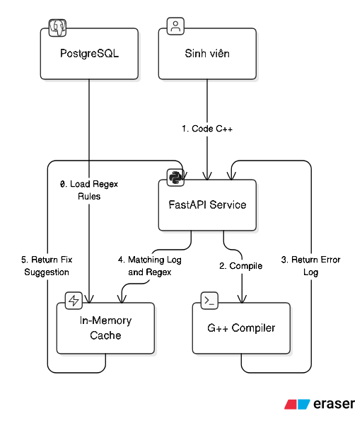
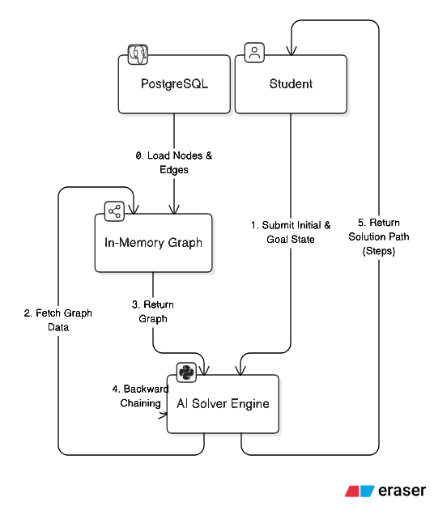

# 🧠 TwinLearn - AI & Knowledge Base Service

Built with **FastAPI**, this microservice serves as the computational core for AI operations. It implements two distinct approaches for each learning task:

- **Knowledge-Based (KB)**: Uses deterministic algorithms, rule engines, and graph theory stored in PostgreSQL.
- **Generative AI (LLM)**: Uses Large Language Models via OpenRouter API.

> Note: These approaches operate independently, allowing students to compare deterministic logic with generative AI advice.

## 🔍 Feature 1: Syntax Checker

### Knowledge-Based Approach

- **Input**: User's C++ code
- **Execution**: Code is compiled in a sandboxed environment (`g++`)
- **Pattern Matching**: Errors are matched against a Regex Knowledge Base to provide accurate, pre-defined fix suggestions

## 🧩 Feature 2: Task Solver Engine

This feature helps students understand logical workflows.

### Knowledge-Based Approach (Graph Search)

Uses a structured graph of **States** and **Steps** stored in the database.

- **Guide Mode**: Uses Backward Chaining Algorithm to find a valid path from Initial State to Goal State.
- **Practice Mode**: Allows users to drag-and-drop their own steps. The engine validates these steps against the Knowledge Graph logic.

> Note: Practice Mode (Step Validation) is currently not implemented for the LLM engine.

## ⚙️ Technical Highlights

- **In-Memory Caching**: Heavy Knowledge Base graphs (States, Rules, Edges) are loaded into RAM on application startup.
- **Comparative Architecture**: The system exposes both Rule-based and AI-based results, enabling comparison.
